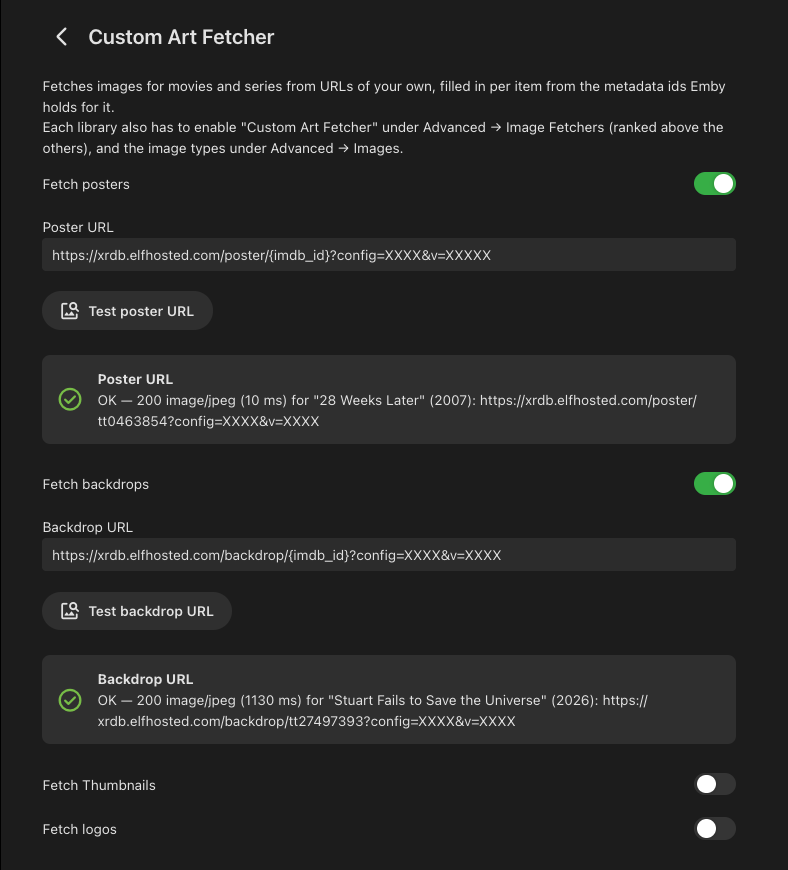
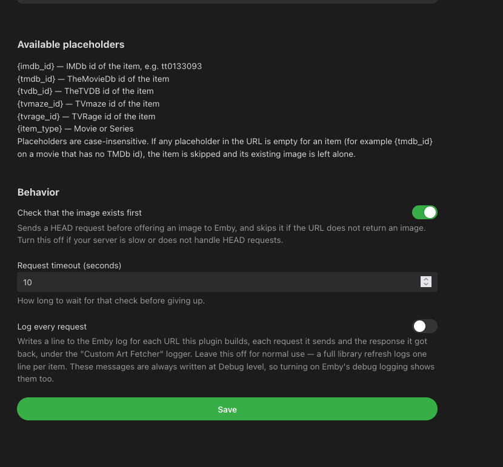

# Custom Art Fetcher

[](https://github.com/barneacode/Emby.Plugin.CustomArtFetcher/actions/workflows/release.yml)

An Emby 4.10 plugin that fetches Posters, Backdrops, Thumbnails and Logos for **movies** and **series**
from URLs you configure, with placeholders filled in per item from the metadata ids Emby holds for it.
Point it at your own art server, an art mirror, or anything that serves an image at a predictable URL.

Example URL:

```
https://art.example.com/posters/{tmdb_id}.jpg
```

<table>
<tr>
<td width="50%"></td>
<td width="50%"></td>
</tr>
</table>

## Settings

The plugin gets its own **Custom Art Fetcher** entry in the dashboard sidebar, under *Advanced*
next to *Plugins*; it is also reachable the usual way via Dashboard → Plugins. The page itself is
generated by Emby from
[`PluginOptions.cs`](src/Emby.Plugin.CustomArtFetcher/Model/PluginOptions.cs) and offers:

| Setting | Meaning |
| --- | --- |
| Poster / Backdrop / Thumbnail / Logo URL | The URL template for that type. Rejected on save only if it is not an absolute http/https address; a blank URL, or one with no placeholders, is allowed. |
| Available placeholders | Read-only list, generated from the catalog so it always matches the build. |
| Check that the image exists first | HEAD the URL before offering it; skip the item if it isn't an image. |
| Request timeout | Timeout for that check. |
| Log every request | Logs each URL built, each request sent and the response, at Info level — each line tagged with the fetcher ranking. |

Each image type has a toggle and its own URL; switching one off hides its URL, Test button and
result, so the form stays short. The four types and what they are:

| Type | Notes |
| --- | --- |
| Poster | The main cover image. On by default. |
| Backdrop | Wide background art. Emby ignores backdrops narrower than 1280 px. |
| Thumbnail | The wide thumbnail used in some list and resume views. |
| Logo | The title treatment over the Backdrop, usually a transparent PNG. |

Each of the four URLs has a **Test** button beside it. Pressing it takes a real item out of your
library, builds the URL the fetcher would build for that item, requests it, and reports what came
back:

```
OK — 200 image/jpeg (24 ms) for "Dune" (2021): https://art.example.com/posters/438631.jpg
```

The request is made by the **server**, not by the browser showing the page, so it tests the path the
fetcher actually uses — including anything only the server can reach. Results are advisory; nothing
is saved or changed by a test.

| Result | Meaning |
| --- | --- |
| Green | The URL returned an image. |
| Red | The URL returned something that is not an image, or nothing at all — the status and the URL tried are shown. |
| Amber | Nothing could be concluded: the URL is empty, the server refuses HEAD requests, or no item in the library had a value for a placeholder the URL uses. |

A test uses a real library item rather than an invented sample id on purpose — a made-up id would
404 against an art server that only hosts what you own, reporting a fault that is not there. Up to
50 items are examined to find one the URL can be built for.

Each press draws a **different** item: the draw is random and the last 10 items tested for that
image type are skipped, so pressing Test repeatedly samples across the library instead of asking
about the same item again. In a library smaller than that the skip list is dropped and the items
cycle.

### Placeholders

`{imdb_id}` `{tmdb_id}` `{tvdb_id}` `{tvmaze_id}` `{tvrage_id}` `{item_type}` `{name}`
`{original_title}` `{year}`, plus `{provider:<name>}` for any other provider id and `{raw:<token>}`
to skip URL-encoding. Case-insensitive.

If any placeholder is empty for an item — say `{tmdb_id}` on a movie with no TMDb id — the plugin
offers nothing for that item and its existing artwork is left alone.

Placeholders live in one place, [`PlaceholderCatalog.cs`](src/Emby.Plugin.CustomArtFetcher/Model/PlaceholderCatalog.cs), which
feeds both the substitution and the help text on the settings page; add a token there and it shows up
in the UI automatically.


## Install

Copy `Emby.Plugin.CustomArtFetcher.dll` into Emby's `plugins` folder and restart the server:

- macOS: `~/.config/emby-server/plugins/` (or the `programdata/plugins` of your install)
- Windows: `%AppData%\Emby-Server\programdata\plugins\`
- Linux: `/var/lib/emby/plugins/`

Delete any older DLL of this plugin from that folder first — the plugin is identified by a fixed id,
so two copies under different file names are loaded as duplicates.

Then, per library: **Library → (library) → Advanced → Image Fetchers** — tick **Custom Art
Fetcher** and drag it to the top, above TMDb. Emby saves the image from the highest-ranked fetcher
that offers one, so a fetcher sitting below TMDb never gets used; the plugin logs its own position to
make that obvious (see [Logging](#logging)). Nothing is fetched until it is enabled here.


## Logging

Every URL the plugin builds, every request it sends and every response it gets back is logged under
the `Custom Art Fetcher` logger in `embyserver.txt`:

```
[#1/3 wins] Resolved Poster URL for "The Matrix": http://localhost:8000/posters/603.jpg
[#1/3 wins] HEAD http://localhost:8000/posters/603.jpg (timeout 10 s)
[#1/3 wins] HEAD http://localhost:8000/posters/603.jpg → 200 image/jpeg (7 ms)
[#1/3 wins] Offering the Poster for "The Matrix": http://localhost:8000/posters/603.jpg
GET http://localhost:8000/posters/603.jpg
GET http://localhost:8000/posters/603.jpg → 200 image/jpeg (12 ms)
```

The `[…]` tag on each line is this plugin's position in that library's image fetcher ranking, which
is the usual reason images are offered but never used. It reads one of four ways:

| Tag | Meaning |
| --- | --- |
| `#1/3 wins` | Top of the ranking — its images are the ones saved. |
| `#3/3 outranked` | Something above it is winning; drag it to the top under Library → Advanced → Image Fetchers. |
| `unranked, so last of 3` | Not ticked in that library's fetcher list, so Emby ranks it last. |
| `default fetcher order` | The library has never had its fetchers ordered, so Emby's own default applies. |

The `GET` lines carry no tag: Emby calls the download with only a URL, so there is no library
context to report there.

The first time each library's configuration is seen, the ranking is also spelled out in full:

```
Image fetchers for Movie: TheMovieDb, TheTVDB, Custom Art Fetcher. "Custom Art Fetcher" is #3 of 3,
so the images it offers are only used when every fetcher above it returns none.
```

That line is written once per configuration, so during a library-wide refresh it scrolls out of
sight — which is why the short tag is repeated on every line.

Items that are skipped say why — a placeholder with no value, a non-image response, a failed or
timed-out request, or a URL still cached as a recent miss.

These lines are always written at **Debug** level, so they appear whenever Emby's debug logging is
on. To follow them without turning debug logging on server-wide, tick **Log every request** on the
plugin page and they are written at **Info** level as well. Leave it off for normal use: a full
library refresh logs several lines per item.

## Notes

- Failures are never thrown at Emby: a missing id, a 404, or a timeout just means "no image offered",
  so an item's refresh is never broken by this plugin.
- URLs that fail their existence check are remembered for 5 minutes, so a full-library refresh does
  not hammer the endpoint with requests already known to fail.
- Posters, Backdrops, Thumbnails and Logos are handled, for movies and series. Episodes and seasons,
  JSON-returning endpoints and auth headers are deliberately out of scope; each is a small additive
  change to `GetSupportedImages`/`Supports` and the options class.

## License

MIT — see [LICENSE](LICENSE).
